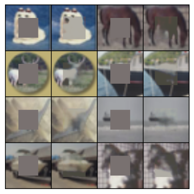
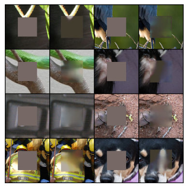

This notebook focuses on the use of self-supervised techniques to learn high-performing image representations. By leveraging pretext tasks that take advantage of the structure of image data.
The following pretext tasks were used to train the three models:
* Context Encoder
* Rotation
* SimCLR).
  
Two datasets were used:
*	CIFAR-10: A dataset consisting of 60,000 color images of 32x32 pixels divided into 10 different classes. Each set has been preprocessed through normalization, resizing, and splitting into training and validation sets.

* ImageNet-100: A subset of the large ImageNet dataset, consisting of 100 classes. This dataset allows for the evaluation of the generalization ability of models on a more diverse set of classes.

The results are diesplayed below respectively for each dataset:  
    
                                  
